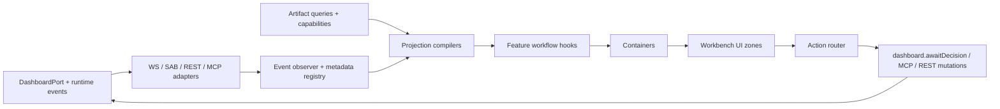

# Dashboard Workbench Application Architecture

*Technical design for Tesseract's flagship dashboard/workbench frontend, adapted from the React North Star and grounded in the repo's current seams. March 27, 2026.*

---

## 0) Purpose

This document translates the earlier design work into an application architecture that the codebase can actually implement.

It is intentionally opinionated. The goal is not to import the React North Star wholesale. The goal is to adopt the parts that make the dashboard more legible, more deterministic, and easier for both humans and agents to extend.

This architecture is a companion to:

- [dashboard-workbench-first-principles.md](/c/Users/danny/OneDrive/Documents/agentic-playwright/docs/dashboard-workbench-first-principles.md)
- [research-master-prioritization-v4.md](/c/Users/danny/OneDrive/Documents/agentic-playwright/docs/research-master-prioritization-v4.md)

---

## 1) What we adopt, adapt, and leave out

The React North Star is useful here, but only when filtered through Tesseract's actual product shape.

| North Star idea | Decision | Why |
|---|---|---|
| Types are the spec | **Adopt fully** | The dashboard already depends on typed events, workbench items, and capabilities. V4 needs stronger type-first contracts, not weaker ones. |
| The folder structure is the architecture | **Adopt fully** | The current `atoms/`, `molecules/`, `organisms/`, `spatial/`, `hooks/` taxonomy is no longer enough. The workbench now needs feature-shaped architecture. |
| Pure domain logic stays out of React | **Adopt, but adapt** | For the dashboard, the pure layer is not business canon. It is projection logic, geometry logic, and queue/timeline derivation. It should still be React-free. |
| Thin containers, narrow props, small files | **Adopt fully** | The current shell and panel components are carrying too much shaping logic. |
| TanStack Query for server state | **Adopt fully** | The dashboard already uses Query and should keep REST and durable artifact reads in that lane. |
| TanStack Router | **Adapt later** | The dashboard is still one workbench shell served from a custom server. Internal modes matter more than URL routing today. Router becomes useful once the workbench gains multiple route-grade screens. |
| Vite | **Defer** | The current dashboard is bundled through `scripts/build.cjs` and served from [server.ts](/c/Users/danny/OneDrive/Documents/agentic-playwright/dashboard/server.ts). Vite may become the right extraction target later, but it is not required for the technical design phase. |
| Radix UI | **Selective adoption** | Good fit for dialogs, menus, drawers, and tabs. Not relevant to the spatial canvas itself. |
| React Hook Form + Zod | **Selective adoption** | Strong fit for clarification forms, human review forms, and policy-rich action dialogs. Not central to the streaming shell. |
| Vitest + RTL + MSW | **Target state, not prerequisite** | The repo currently centers law tests and Playwright. The near-term architecture should add pure projection tests first, then introduce a dedicated frontend component test stack when the dashboard is extracted enough to justify it. |
| `eslint-plugin-boundaries` | **Adopt in spirit immediately** | Whether via that plugin or extended `no-restricted-imports`, the dashboard needs machine-enforced boundaries. |

### Practical reading of the North Star

For this repo, the North Star is less about "use this exact web stack" and more about five structural promises:

1. Components should render, not reason.
2. The directory tree should make ownership obvious.
3. Projection logic should be pure and typed.
4. Live state, durable state, and local UI state should be different things.
5. The right place for a change should be obvious before implementation begins.

---

## 2) Architectural thesis

The dashboard is a projection application, not a source-of-truth application.

That changes the architecture in one important way: alongside the usual React layers, the dashboard needs a **pure projection layer** that compiles raw pipeline events, artifact reads, capability reports, and geometry into stable view models for the UI.

The resulting stack should be:

1. **Infrastructure adapters** for WebSocket, `SharedArrayBuffer`, REST, MCP, and live portal capability.
2. **Projection compilers** for event metadata, queue lifecycle, timeline nodes, geometry anchors, and inspector models.
3. **Feature hooks** that combine those pure projections into feature workflows.
4. **Containers** that perform loading/error/success wiring and nothing else.
5. **Presentational components** that render one clear zone of the workbench.

### Non-negotiable rules

1. The dashboard never invents canon. It only projects existing truth and local UI state.
2. `BoundingBox`, capture dimensions, and overlay ratios are platform contracts, not ad hoc component math.
3. A React component should not decide workbench semantics on the fly.
4. The event stream hot path and the artifact query path must converge into the same view-model layer.
5. One architectural pattern should repeat at every scale: type contracts, pure derivation, orchestration hook, presentational surface.

---

## 3) Current state and why it must change

The current dashboard has strong ingredients, but its structure still reflects a prototype stage.

### 3.1 What exists now

- [app.tsx](/c/Users/danny/OneDrive/Documents/agentic-playwright/dashboard/src/app.tsx) is a 333-line composition shell that still owns too many responsibilities.
- [types.ts](/c/Users/danny/OneDrive/Documents/agentic-playwright/dashboard/src/types.ts) acts as a broad projection bucket rather than a set of feature contracts.
- [dashboard-event-observer.ts](/c/Users/danny/OneDrive/Documents/agentic-playwright/dashboard/src/hooks/dashboard-event-observer.ts) and related hooks do valuable work, but event semantics remain scattered.
- [workbench-panel.tsx](/c/Users/danny/OneDrive/Documents/agentic-playwright/dashboard/src/organisms/workbench-panel.tsx) and neighboring organisms still shape data inline.
- [spatial/](/c/Users/danny/OneDrive/Documents/agentic-playwright/dashboard/src/spatial/types.ts) already contains the seeds of a real geometry system, but rendering and geometry contracts are still interwoven.

### 3.2 Structural gaps

1. The folders describe visual granularity, not feature ownership.
2. The live stream path, REST path, and MCP path do not converge through one explicit projection compiler.
3. Dashboard TypeScript is bundled, but not part of the root `tsconfig.json` typecheck include set.
4. The dashboard has no dedicated import-boundary enforcement today.
5. The workbench information architecture from the design doc is not yet mirrored in the code tree.

### 3.3 What this means

Without a new architecture, V4 risks producing:

- a more beautiful UI over the same scattered semantics
- a more powerful agent surface over the same implicit queue logic
- more overlays without a shared geometry contract
- more components without a deterministic home

That would look better for a while and then drift again.

---

## 4) Target dashboard frontend structure

The folder tree should mirror the workbench's five-zone information architecture, with one additional runtime feature for live orchestration.

```text
dashboard/src/
├── app/
│   ├── App.tsx
│   ├── providers/
│   │   ├── QueryProvider.tsx
│   │   ├── DashboardModeProvider.tsx
│   │   ├── DashboardSelectionProvider.tsx
│   │   └── index.ts
│   └── shell/
│       ├── DashboardShell.tsx
│       ├── DashboardDesktopLayout.tsx
│       └── DashboardCompactLayout.tsx
├── features/
│   ├── workbench-runtime/
│   │   ├── index.ts
│   │   ├── types.ts
│   │   ├── domain/
│   │   ├── hooks/
│   │   └── containers/
│   ├── presence-bar/
│   ├── surface-stage/
│   │   ├── index.ts
│   │   ├── types.ts
│   │   ├── domain/
│   │   ├── hooks/
│   │   ├── components/
│   │   ├── containers/
│   │   └── scene/
│   ├── resolve-lane/
│   ├── storyline-rail/
│   └── inspector-drawer/
├── projections/
│   ├── events/
│   ├── timeline/
│   ├── workbench/
│   ├── overlays/
│   └── inspector/
├── shared/
│   ├── atoms/
│   ├── molecules/
│   ├── hooks/
│   ├── utils/
│   └── types/
└── infrastructure/
    ├── api/
    ├── stream/
    ├── mcp/
    └── portal/
```

### Why this shape

- `features/` follows the information architecture, not generic UI taxonomy.
- `workbench-runtime/` is the one cross-cutting feature that owns streaming runtime state and optimistic decisions.
- `projections/` is the adaptation the North Star does not name explicitly, but this repo needs.
- `shared/` remains small and generic. If something smells like workbench semantics, it does not belong there.
- `infrastructure/` isolates fetch, event transport, MCP, and portal capability concerns from the React tree.

---

## 5) Dependency direction law

The import graph should be deterministic.

```text
app/*                    -> features/*/containers, app/providers, shared/*
features/*/containers    -> features/*/hooks, features/*/components, shared/*
features/*/hooks         -> features/*/domain, features/*/types, projections/*, infrastructure/*, shared/*
features/*/components    -> features/*/types, shared/*
features/*/domain        -> features/*/types, projections/*, shared/utils, shared/types
projections/*            -> shared/types
infrastructure/*         -> shared/types
shared/molecules         -> shared/atoms, shared/utils, shared/types
shared/atoms             -> shared/utils, shared/types
```

### Forbidden directions

- `features/*/domain -> react`
- `features/*/components -> infrastructure/*`
- `features/*/components -> features/*/hooks`
- `shared/* -> features/*`
- `projections/* -> react`
- `infrastructure/* -> features/*`
- `features/* -> other-feature/components/*`

### Machine enforcement plan

The dashboard should gain explicit boundary rules, either by:

1. extending [eslint.config.cjs](/c/Users/danny/OneDrive/Documents/agentic-playwright/eslint.config.cjs) with dashboard-specific `no-restricted-imports` and file-pattern rules, or
2. adding `eslint-plugin-boundaries` for the dashboard tree.

The important part is not the plugin choice. The important part is that dashboard layering stops being convention-only.

---

## 6) Canonical data flow

The dashboard has four input classes and one output class.

### 6.1 Inputs

1. **Live event stream**
   - WebSocket events
   - `SharedArrayBuffer` probe path
   - pause/resume and decision completion events
2. **Durable artifact reads**
   - `/api/workbench`
   - `/api/fitness`
   - workbench lineage and completion artifacts
3. **Capability and tool surfaces**
   - `/api/capabilities`
   - MCP tool inventory and results
4. **Local UI state**
   - selection
   - layout mode
   - reduced-motion preference
   - replay cursor

### 6.2 Output

The output is not raw event objects. The output is a set of typed **feature view models**.



### 6.3 State classes

Each state class should live in one place only.

| State class | Examples | Owner |
|---|---|---|
| Stream state | progress, probe events, stage lifecycle, pause context | `features/workbench-runtime` |
| Query state | workbench artifact, scorecard, capabilities, knowledge snapshots | feature hooks using Query |
| Local UI state | selected entity, drawer visibility, mode, replay cursor | `app/providers` |
| Derived feature state | grouped queue, timeline nodes, overlay anchors, inspector panels | `projections/` and feature domain |

This separation is one of the most important architectural constraints in the whole design.

---

## 7) Types first: the contracts that should exist before implementation

V4 should start by making the dashboard's most important contracts explicit.

```ts
export interface DashboardCapabilities {
  readonly screenshotStream: boolean;
  readonly liveDomPortal: boolean;
  readonly mcpServer: boolean;
  readonly playwrightMcp: boolean;
  readonly replayAvailable: boolean;
  readonly geometryAvailable: boolean;
}

export interface SurfaceSnapshot {
  readonly surfaceId: string;
  readonly sourceWidth: number;
  readonly sourceHeight: number;
  readonly url: string;
  readonly capturedAt: string;
  readonly mode: 'screenshot' | 'live-portal';
}

export interface OverlayAnchor {
  readonly id: string;
  readonly surfaceId: string;
  readonly rect: {
    readonly x: number;
    readonly y: number;
    readonly width: number;
    readonly height: number;
  };
  readonly actor: 'system' | 'agent' | 'operator';
  readonly governance: 'approved' | 'review-required' | 'blocked';
}

export interface ResolveLaneViewModel {
  readonly now: ResolveItemViewModel | null;
  readonly agent: readonly ResolveGroupViewModel[];
  readonly needsHuman: readonly ResolveGroupViewModel[];
  readonly resolved: readonly ResolveItemViewModel[];
}

export interface TimelineNode {
  readonly id: string;
  readonly kind: string;
  readonly at: string;
  readonly label: string;
  readonly severity: 'neutral' | 'info' | 'warning' | 'critical';
  readonly linkedEntityIds: readonly string[];
}

export type InspectorSelection =
  | { readonly kind: 'work-item'; readonly id: string }
  | { readonly kind: 'timeline-node'; readonly id: string }
  | { readonly kind: 'surface-target'; readonly id: string }
  | { readonly kind: 'proposal'; readonly id: string };
```

### Design rule

If a UI behavior matters enough to appear in the workbench, it should be backed by a named type before it is backed by JSX.

---

## 8) Feature responsibilities

Each zone should own a small, deterministic surface.

### 8.1 `workbench-runtime`

Purpose:

- own event ingestion
- own optimistic decision state
- own event observer wiring
- own the queue lifecycle reducer and event metadata registry

It should be the home for the breakup of today's [app.tsx](/c/Users/danny/OneDrive/Documents/agentic-playwright/dashboard/src/app.tsx) stream logic.

### 8.2 `presence-bar`

Purpose:

- show current run identity
- show active participant and host
- show capability availability
- show current mode and health

It should not know anything about queue grouping or overlay math.

### 8.3 `surface-stage`

Purpose:

- render screenshot or live portal
- render shared overlay layers
- manage responsive surface rect measurement
- host the spatial scene and motion system

The `scene/` folder exists because this feature legitimately has a complex rendering subtree. That complexity should stay quarantined there.

### 8.4 `resolve-lane`

Purpose:

- render `Now`, `Agent`, `Needs Human`, and `Resolved`
- present grouped queue cards and action surfaces
- expose queue pressure, batching hints, and recent completions

This feature should consume grouped, pre-shaped view models. It should not decide grouping rules inline.

### 8.5 `storyline-rail`

Purpose:

- render the chronological event narrative
- own filters and scrub state
- coordinate replay cursor with the rest of the shell

This feature is the human-readable memory of the run.

### 8.6 `inspector-drawer`

Purpose:

- explain whatever is selected
- show evidence, lineage, trust, and actions
- provide detail without cluttering the stage

The drawer should be selection-driven and entity-agnostic. It should not fetch arbitrarily based on loose component conditions.

---

## 9) The projection layer: the dashboard-specific adaptation

This repo needs a pure projection layer because raw pipeline truth is richer than direct component props and more volatile than stable UI models.

### 9.1 What belongs in `projections/`

- event metadata registry
- queue lifecycle reducer
- timeline node compiler
- overlay anchor normalizer
- inspector panel compiler
- view-mode specific transformations

### 9.2 What does not belong in `projections/`

- React hooks
- DOM measurement
- fetch calls
- WebSocket setup
- button click handlers

### 9.3 Why this matters

If the projection layer is missing, components end up doing one of two bad things:

1. repeating derivation logic inconsistently, or
2. rendering directly from raw event objects and artifact shapes

Both increase drift. Both make agent-maintained UI harder.

---

## 10) Geometry and overlay architecture

The overlay system deserves its own architectural rule set because it crosses rendering modes, devices, and interaction surfaces.

### 10.1 Geometry contracts live in pure code

Geometry math should not live inside JSX branches.

Recommended pure functions:

- `normalize-overlay-anchor.ts`
- `anchor-to-ratios.ts`
- `ratios-to-display-rect.ts`
- `build-overlay-view-model.ts`
- `resolve-surface-hit-target.ts`

### 10.2 One geometry contract, many renderers

Both CSS overlays and WebGL overlays should consume the same normalized anchor contract:

1. source capture rect is canonical
2. ratios are the transport format
3. renderer-specific transforms are last-mile only

### 10.3 Degradation rules

If geometry is missing:

- do not fake precision
- fall back to screen-scoped or element-scoped explanation
- preserve selection and inspector context
- expose geometry availability through the capability contract

This is exactly the kind of deterministic behavior the North Star is trying to force.

---

## 11) Build, typecheck, and enforcement changes

The dashboard needs architecture enforcement to become real, not aspirational.

### 11.1 Immediate changes

1. Add a dashboard-specific `tsconfig` and include it in root typecheck or project references.
2. Add dashboard-specific ESLint boundaries and size thresholds.
3. Add `max-lines` or equivalent guardrails for dashboard components, hooks, and container files.
4. Add type-only public `index.ts` barrels for each feature.

### 11.2 Thresholds worth carrying over

These are the North Star constraints that do serve this scope:

- component files target `60-80` lines
- hook files target `40-60` lines
- container files target `25-40` lines
- props target `3-5` fields and hard-stop at `7`
- one effect per presentational component, two max for containers

These should be treated as prompts to split, not as decorative advice.

### 11.3 Tooling decisions for this phase

| Concern | Decision |
|---|---|
| TypeScript strictness | Keep and extend to the dashboard source tree |
| React Query | Keep |
| Router | Defer until multiple route-grade screens exist |
| Vite | Defer until dashboard extraction is worth the churn |
| Radix | Adopt selectively for drawer, dialogs, menus, tabs |
| Zod | Use for clarification/action forms |
| Component unit stack | Add later when dashboard package boundaries are cleaner |
| Law tests | Add now for projections, queue state machine, and geometry |

---

## 12) Testing shape for the dashboard architecture

The dashboard should follow the repo's strengths first.

### Near-term

- law tests for queue lifecycle transitions
- law tests for overlay normalization and responsive mapping
- law tests for timeline compilation and event metadata exhaustiveness
- integration tests for optimistic decision projection
- Playwright tests for the key workbench flows

### Later, once the dashboard tree is cleaner

- component tests for presentational features
- hook integration tests around Query and capability fallbacks
- MSW-backed tests for dashboard REST surfaces

The main idea is the same as the North Star even if the tooling arrives in phases: pure layers get cheap tests first, UI layers get behavior tests once their seams are stable.

---

## 13) Migration map from the current dashboard

This is the minimal-friction way to move from today's structure to the target one.

| Current file or folder | Target home | Reason |
|---|---|---|
| [app.tsx](/c/Users/danny/OneDrive/Documents/agentic-playwright/dashboard/src/app.tsx) | `app/App.tsx` plus `features/workbench-runtime/hooks/*` | Split shell composition from runtime orchestration |
| [types.ts](/c/Users/danny/OneDrive/Documents/agentic-playwright/dashboard/src/types.ts) | feature `types.ts` files plus `shared/types` | Stop using one broad projection bucket |
| [hooks/dashboard-event-observer.ts](/c/Users/danny/OneDrive/Documents/agentic-playwright/dashboard/src/hooks/dashboard-event-observer.ts) | `features/workbench-runtime/hooks/` plus `projections/events/` | Separate transport from event semantics |
| [hooks/use-workbench-decisions.ts](/c/Users/danny/OneDrive/Documents/agentic-playwright/dashboard/src/hooks/use-workbench-decisions.ts) | `features/workbench-runtime/hooks/` and `projections/workbench/` | Split optimistic mutation flow from queue derivation |
| [organisms/workbench-panel.tsx](/c/Users/danny/OneDrive/Documents/agentic-playwright/dashboard/src/organisms/workbench-panel.tsx) | `features/resolve-lane/components/` | This is a zone component, not a generic organism |
| [organisms/queue-visualization.tsx](/c/Users/danny/OneDrive/Documents/agentic-playwright/dashboard/src/organisms/queue-visualization.tsx) | `features/resolve-lane/components/` | Same reason |
| [organisms/completions-panel.tsx](/c/Users/danny/OneDrive/Documents/agentic-playwright/dashboard/src/organisms/completions-panel.tsx) | `features/resolve-lane/components/` or `storyline-rail/components/` | Resolved history belongs to a named zone |
| [organisms/pipeline-progress.tsx](/c/Users/danny/OneDrive/Documents/agentic-playwright/dashboard/src/organisms/pipeline-progress.tsx) | `features/storyline-rail/components/` | This is run narrative |
| [organisms/convergence-panel.tsx](/c/Users/danny/OneDrive/Documents/agentic-playwright/dashboard/src/organisms/convergence-panel.tsx) | `features/presence-bar/components/` or `storyline-rail/components/` | It belongs to run status, not a generic organism bucket |
| [spatial/](/c/Users/danny/OneDrive/Documents/agentic-playwright/dashboard/src/spatial/canvas.tsx) | `features/surface-stage/scene/` and `projections/overlays/` | Split scene rendering from geometry math |

---

## 14) Recommended implementation sequence

This is the work plan I would use to execute the architecture with minimal churn.

1. **Land contracts first**
   Write the new capability, selection, resolve-lane, timeline, and geometry types before moving UI files.
2. **Introduce the projection layer**
   Extract pure queue grouping, timeline compilation, event metadata, and overlay normalization out of components and runtime hooks.
3. **Carve out `workbench-runtime`**
   Break the live stream, optimistic decisions, and observer orchestration out of `app.tsx`.
4. **Split the shell by workbench zone**
   Create containers for `presence-bar`, `surface-stage`, `resolve-lane`, `storyline-rail`, and `inspector-drawer`.
5. **Move spatial code under `surface-stage`**
   Keep scene rendering local to the stage feature and move pure geometry into `projections/overlays`.
6. **Add enforcement**
   Typecheck inclusion, lint boundaries, and file-size thresholds come next so the new shape stays intact.
7. **Then begin V4 feature work**
   Only after the shell, contracts, and projection layer exist should the richer trust, replay, and agent presence features land.

This sequence makes the architecture do useful work immediately instead of waiting for a later cleanup sprint.

---

## 15) Final recommendation

The right move for V4 is not to start with more panels or more animation. It is to make the dashboard structurally honest.

That means:

1. organize the frontend around the five workbench zones
2. add a pure projection layer as a first-class architectural concept
3. make geometry a shared contract
4. move stream orchestration into a dedicated runtime feature
5. enforce the new shape with types and lint rules before the feature wave arrives

If we do that first, the richer UI direction from the design doc has a stable place to live, and the roadmap in V4 becomes much more likely to age well.
